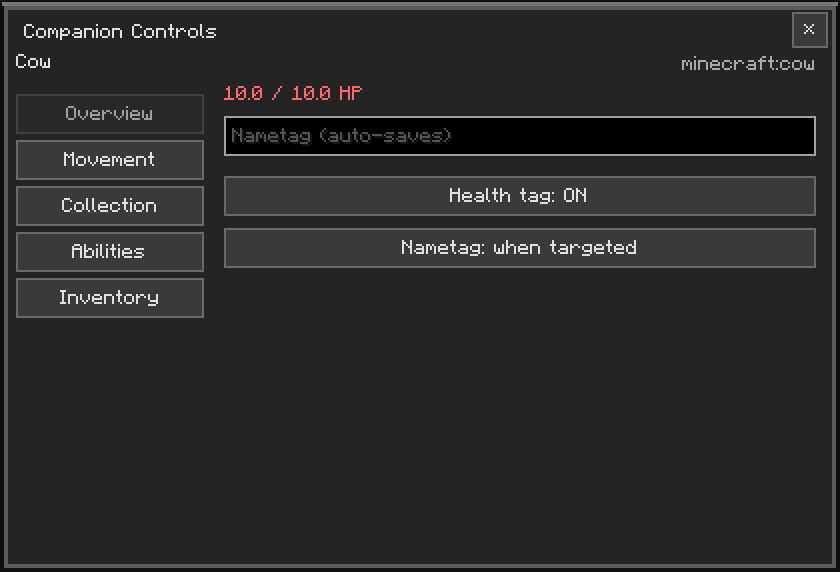
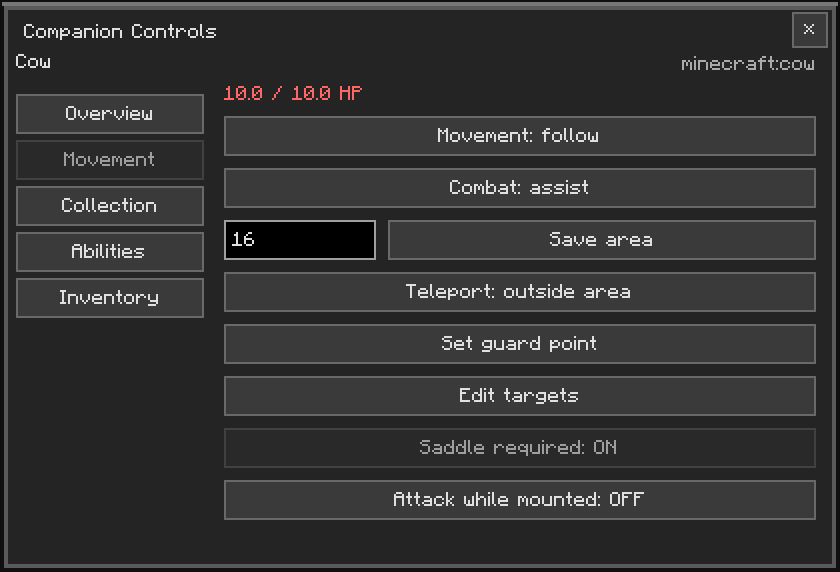
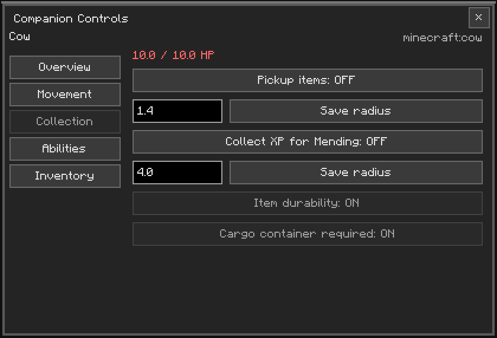
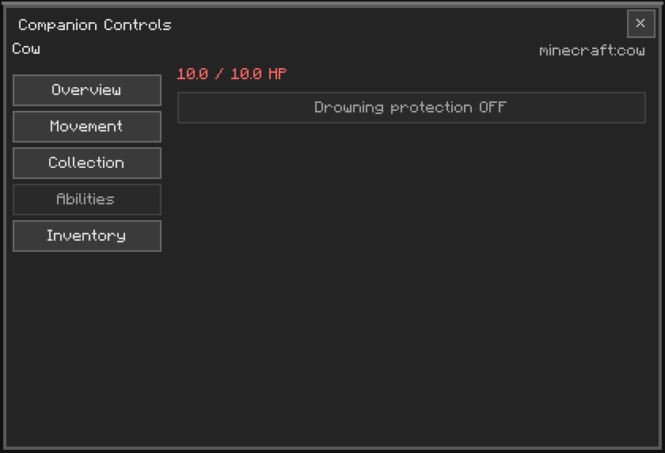
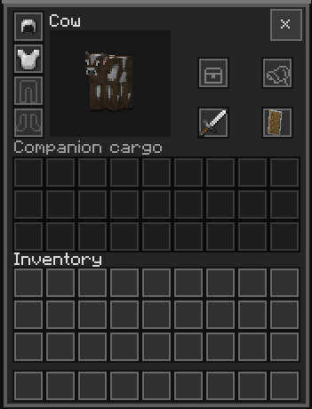
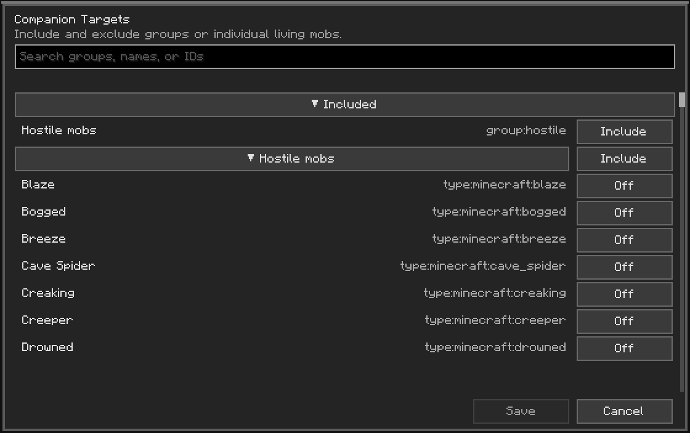
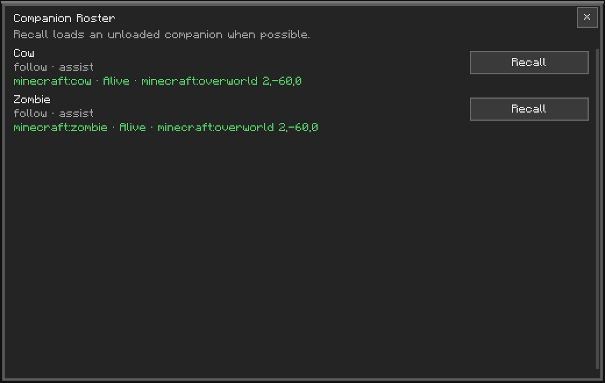
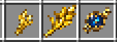

# TameAll

[](https://github.com/riqvip/tameall/actions/workflows/build.yml)

TameAll is a Fabric mod for Minecraft Java 26.2 that turns eligible living
creatures into persistent, configurable companions while keeping their original
entity, equipment, variant, and name.

## Screenshots

| Companion controls | Movement and combat |
|:--:|:--:|
|  |  |

| Collection | Abilities |
|:--:|:--:|
|  |  |

| Companion inventory | Target editor |
|:--:|:--:|
|  |  |

| Companion roster | Riding |
|:--:|:--:|
|  |  |

| Item textures |
|:--:|
|  |

## Features

- Bond eligible creatures with Golden Wheat or the chance-based Gilded Wheat.
- Vanilla taming stays separate: naturally tamed wolves, cats, parrots,
  nautiluses, and horse-family mobs cannot also be bonded with Golden Wheat,
  and a Golden Wheat companion cannot be natively tamed afterward.
- Manage movement, combat stance, operating area, protection abilities, item
  collection, equipment, cargo, and nametags from dark-themed screens.
- Use Passive, Assist, or Defend Area behavior with include and exclude target
  groups, entity types, and tags.
- Recall existing companions with the Companion Whistle, including companions
  that are currently unloaded when they can be found.
- Preserve bond state, equipment, cargo, target selections, and roster records
  across saves and entity conversions.
- Keep the original entity and its behavior identity while making its actions
  owner-aware and configurable.
- Ride bonded pets with a saddle by default. Permission level 2 can waive the
  saddle requirement per pet. Ground, hopping, flying, aquatic, amphibious,
  and stationary profiles use the pet's movement attributes and effects; native
  mount controls remain native.
  Mounted attacks are off by default and use the pet's normal melee, ranged, and
  special attack goals when enabled without allowing pursuit or autonomous
  steering. Companion inventory titles use the pet name or localized species
  name, while the saddle, chest, and offhand empty-slot outlines remain visible.
  Press the normal inventory key (E by default) while mounted to open the
  ridden companion's inventory. Cargo requires an equipped chest, trapped chest,
  barrel, or shulker box by default; permission level 2 can waive that per pet.
  Shulker cargo stays packed in the shulker when it is removed.
- Movement controls scroll when the minimized window cannot fit every option.

## Development status

TameAll `0.2.0` is an alpha prerelease. Starting with this release, the mod
metadata and JAR use plain semantic versions; the `v` prefix is reserved for
Git tags and GitHub release names. Alpha status is communicated by the GitHub
prerelease label and release notes.
The common and client source sets compile, all 27 server GameTests pass, and the
client GameTest passes with inventory screenshots at multiple GUI scales plus a
ridden zombie movement check. Manual visual riding and multiplayer checks remain
separate from automated tests.
Headless runs normally include narrator, OpenAL, and online-auth warnings.

## Requirements

- Minecraft Java 26.2
- Fabric Loader 0.19.5 or newer
- Fabric API for Minecraft 26.2

## Building and testing

Use Java 25 and run Gradle through the included wrapper:

```text
./gradlew compileJava compileClientJava
./gradlew runGameTestServer
./gradlew runClientGameTest
./gradlew build
```

The release JAR is written to `build/libs/`.

## Release track

Starting with `0.2.0`, TameAll uses plain SemVer values for Fabric metadata and
JAR names. Git tags and GitHub release names use the `v` prefix, and GitHub's
prerelease label identifies alpha and beta builds.

- `0.2.0` — current alpha feature release.
- `0.2.1` — compatible bugfix release for the `0.2.x` line.
- `0.3.0` — next compatible feature release.
- `1.0.0` — first stable release.

The previous development package was named `v0.1.0-alpha.1`; it remains a
historical release under that name.

## License

TameAll is licensed under the [Mozilla Public License 2.0](LICENSE).
